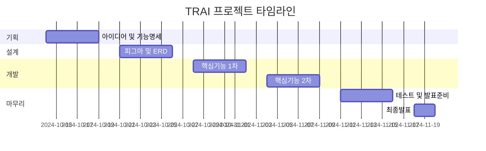

# TRAI: 생성형 AI와 멀티 에이전트를 활용한 투자 자동매매 서비스


### "생성형 AI와 멀티 에이전트를 활용한 투자 자동매매 서비스"

## 🤖 프로젝트 개요

**팀명**: 행복자유  
**기간**: 2024.10.14 - 2024.11.19 (6주)

### 💡 핵심 가치
- ⏰ 시간과 공간 제약 없는 자동 투자
- 🤖 AI 에이전트 기반 자동 분석 및 매매
- 👤 개인 맞춤형 투자 전략
- 🔄 지속적인 서비스 확장 (추가 종목 및 에이전트)

## 👤 팀 구성
| 분야 | 인원 |
|------|------|
| AI | 2명 |
| Frontend | 2명 |
| Backend | 2명 (인프라 1명) |

## 🎯 타겟 사용자
1. 💼 시간적 제약으로 자유로운 투자가 어려운 사용자
2. 📚 투자 지식이 부족하여 전문적인 판단이 필요한 사용자

## 🛠 기술 스택

### Frontend
<div style="background-color: #f8f9fa; padding: 15px; border-radius: 5px;">


</div>

### Backend
<div style="background-color: #f8f9fa; padding: 15px; border-radius: 5px;">


</div>

### AI
<div style="background-color: #f8f9fa; padding: 15px; border-radius: 5px;">


</div>

### Infrastructure
<div style="background-color: #f8f9fa; padding: 15px; border-radius: 5px;">


</div>

### Monitoring
<div style="background-color: #f8f9fa; padding: 15px; border-radius: 5px;">


</div>

### Server Specifications
| 구분 | 사양 |
|------|------|
| 일반 서버 | AWS EC2 t2.xlarge (CPU: 4/8, RAM: 16GB) |
| AI 서버 | AWS EC2 c6g.2xlarge (CPU: 4/8, RAM: 16GB) |
| OS | Ubuntu 20.04.6 LTS / 22.04.5 LTS (AI서버) |

## 📊 주요 기능

### 1. 자산 관리
- 💰 실시간 입출금 연동
- ⚙️ 맞춤형 거래 조건 설정
- 📈 목표 수익률 및 손절 관리

### 2. 투자 현황
- 📊 실시간 시세 모니터링
- 💹 투자 수익률 추적
- 📝 상세 거래 내역 기록

### 3. AI 자동 거래
- 🤖 멀티 에이전트 기반 의사결정
- 📰 뉴스 기반 감성 분석
- 📊 기술적 분석 자동화
- 🔄 자동 매매 실행

## 📅 프로젝트 일정

| 단계 | 작업 | 기간 |
|------|------|------|
| **기획** | 아이디어 및 기능명세 | 2024-10-14 ~ 2024-10-18 (5일) |
| **설계** | 피그마, ERD, API 명세서 | 2024-10-21 ~ 2024-10-25 (5일) |
| **개발** | 핵심기능 1차 | 2024-10-28 ~ 2024-11-01 (5일) |
| | 핵심기능 2차 | 2024-11-04 ~ 2024-11-08 (5일) |
| **마무리** | 테스트 및 발표준비(UCC, PPT) | 2024-11-11 ~ 2024-11-15 (5일) |
| | 최종발표 | 2024-11-18 ~ 2024-11-19 (2일) |



## 🌟 프로젝트 특장점
1. **실시간 자동화**
   - 24/7 끊김없는 투자 모니터링
   - 즉각적인 시장 대응

2. **멀티 에이전트 시스템**
   - 다양한 관점의 투자 분석
   - 균형잡힌 의사결정

3. **개인화**
   - 사용자 맞춤 투자 전략
   - 유연한 설정 관리

## 📱 주요 화면
### 📌 자산 현황 페이지

### 📌 투자 내역 페이지

### 📌 거래 상세 및 전략 페이지

### 📌 거래 설정 페이지

### 📌 비트봇

## 🚀 설치 및 실행
자세한 설치 방법은 `/exec` 폴더의 포팅 매뉴얼을 참고해 주세요.

## 👥 팀원소개


## 📝 프로젝트 후기
### 👩‍💻 임가현

### 👩‍💻 정여진

### 👨‍💻 배성진

### 🐧 홍주형

```
초기에는 LLM을 실제 개발에 적용해본 경험이 전무했기에 상당한 부담감이 있었습니다. 다양한 문서와 자료를 참고하며 학습 곡선을 극복해야 했지만, 실제 구현 과정에서 LLM의 접근성과 활용성이 예상보다 훨씬 뛰어남을 발견했습니다. 이는 LLM을 활용한 개발을 할 때 일반적인 개발 지식과 함께 프롬프트 엔지니어링 부분도 중요하다는 통찰을 얻는 소중한 경험이었습니다.

AI 기술 학습에 집중하다 보니 백엔드와 프론트엔드 개발에 충분한 시간을 할애하지 못한 아쉬움이 있습니다. 하지만 각자의 전문 분야에서 뛰어난 역량을 발휘한 팀원들의 협업 덕분에 프로젝트를 성공적으로 완수할 수 있었습니다

이번 프로젝트의 성공은 팀원들의 전문성을 신뢰하고, 각자의 책임을 다한 팀워크의 덕분입니다. 또한, 팀원 구성과 기획 부분에서 저를 믿고 맡겨주신 팀원들 덕분에 저의 역량을 발휘할 수 있었던 것 같습니다. 마지막으로, 프로젝트를 하면서 좋은 사람들과 좋은 시간을 보낼 수 있어서 저에게는 매우 의미있는 프로젝트였습니다.
```


### 👨‍💻 김병연


### 👨‍💻 김재현

## 📜 License
This project is licensed under the MIT License - see the [LICENSE](LICENSE) file for details.