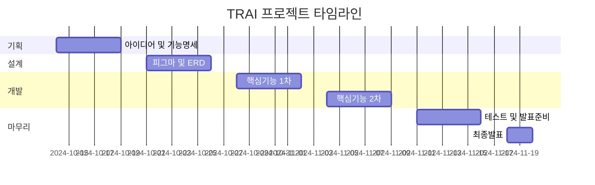
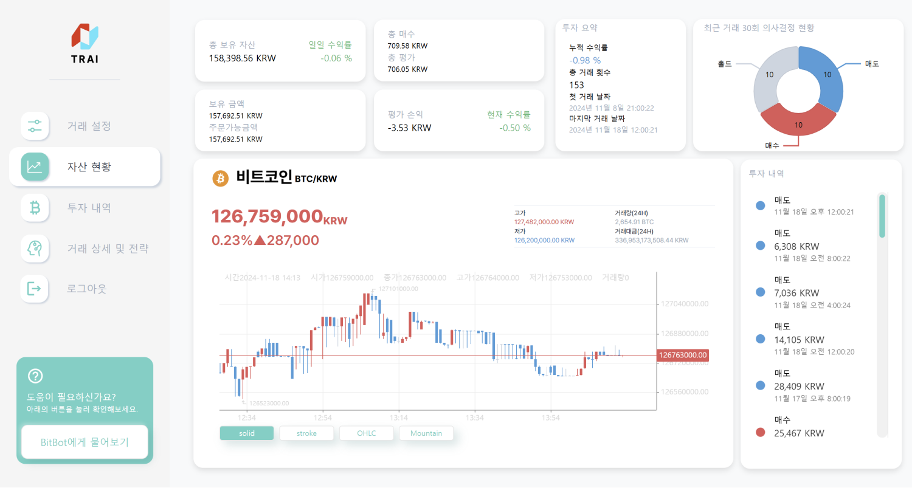
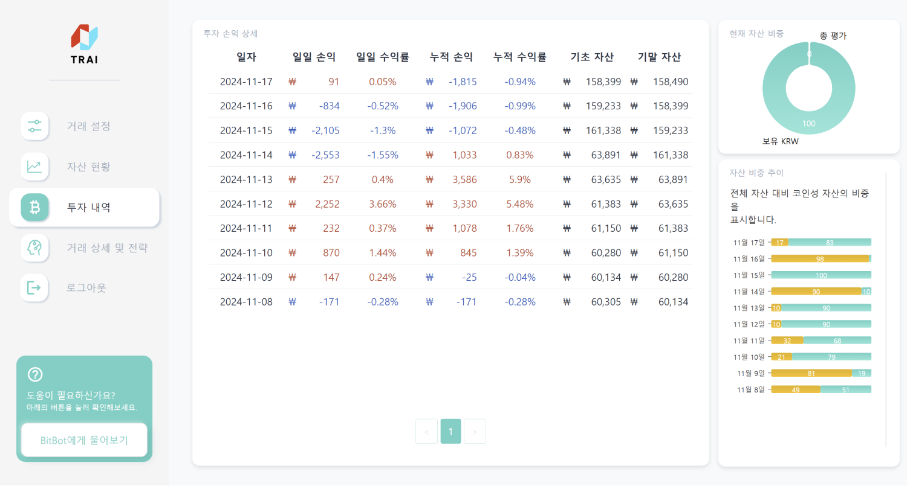
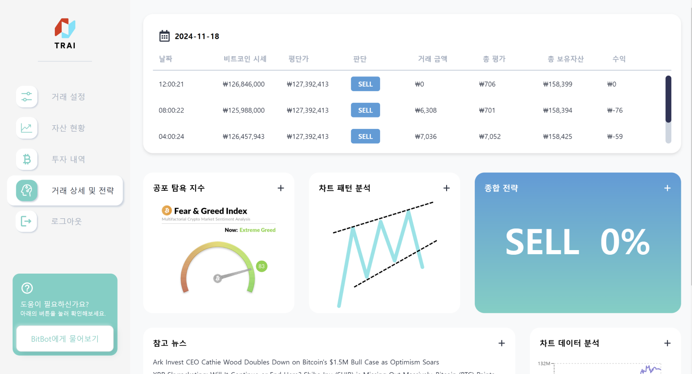
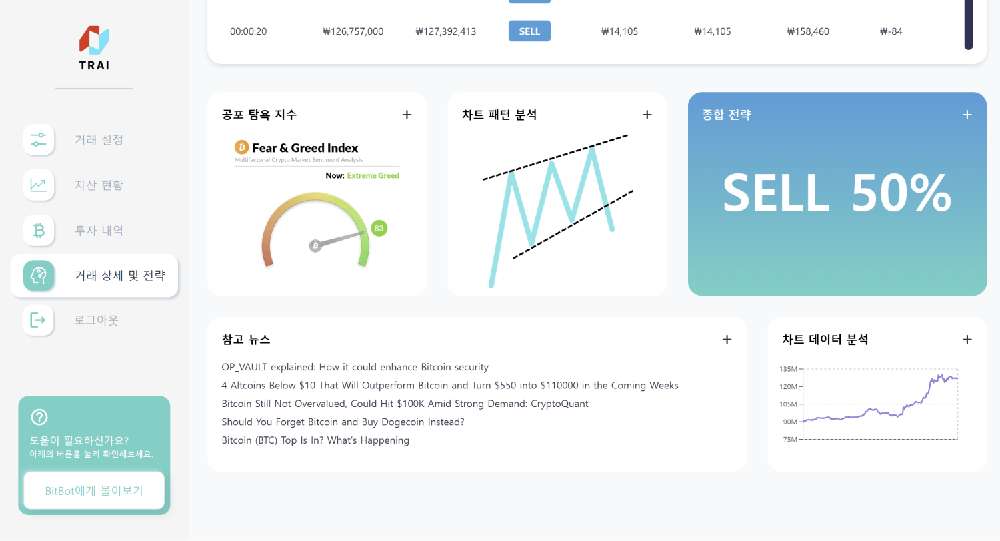
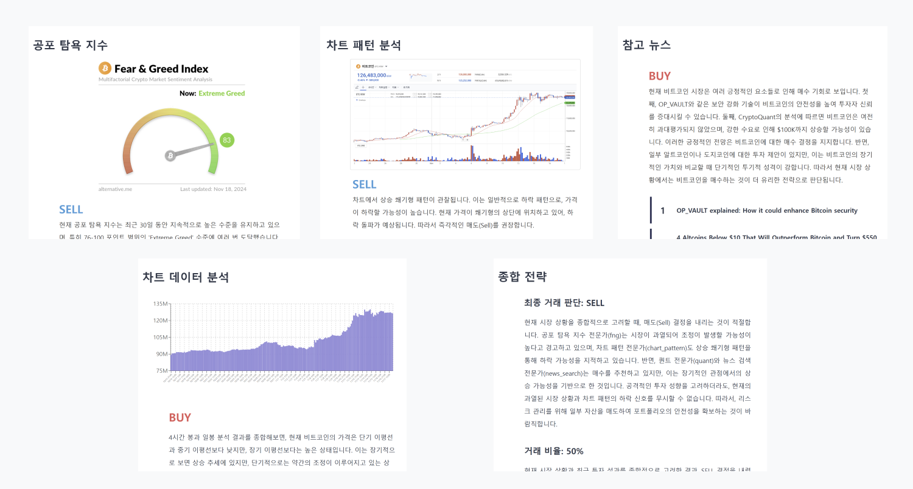
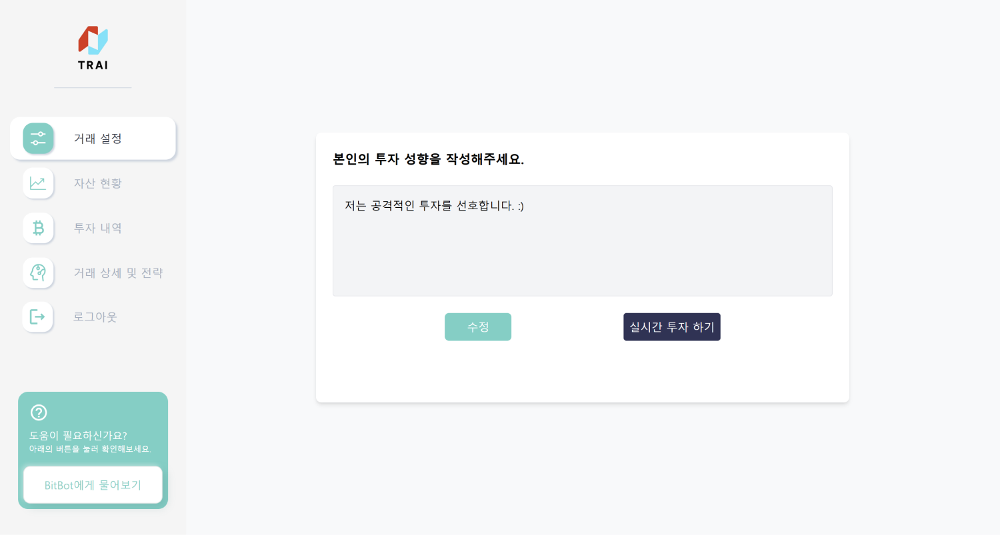
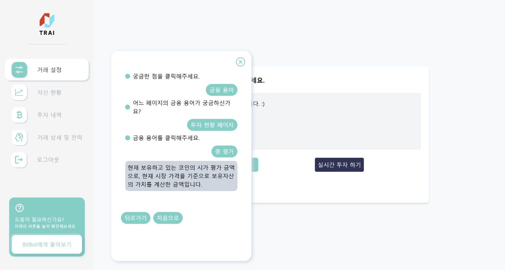

# TRAI: 생성형 AI와 멀티 에이전트를 활용한 투자 자동매매 서비스


### "생성형 AI와 멀티 에이전트를 활용한 투자 자동매매 서비스"

## 🤖 프로젝트 개요

**팀명**: 행복자유  
**기간**: 2024.10.14 - 2024.11.19 (6주)

### 💡 핵심 가치

- ⏰ 시간과 공간 제약 없는 자동 투자
- 🤖 AI 에이전트 기반 자동 분석 및 매매
- 👤 개인 맞춤형 투자 전략
- 🔄 지속적인 서비스 확장 (추가 종목 및 에이전트)

## 👤 팀 구성

| 분야     | 인원             |
| -------- | ---------------- |
| AI       | 2명              |
| Frontend | 2명              |
| Backend  | 2명 (인프라 1명) |

## 🎯 타겟 사용자

1. 💼 시간적 제약으로 자유로운 투자가 어려운 사용자
2. 📚 투자 지식이 부족하여 전문적인 판단이 필요한 사용자

## 🛠 기술 스택

### Frontend

<div style="background-color: #f8f9fa; padding: 15px; border-radius: 5px;">


</div>

### Backend

<div style="background-color: #f8f9fa; padding: 15px; border-radius: 5px;">


</div>

### AI

<div style="background-color: #f8f9fa; padding: 15px; border-radius: 5px;">


</div>

### Infrastructure

<div style="background-color: #f8f9fa; padding: 15px; border-radius: 5px;">


</div>

### Monitoring

<div style="background-color: #f8f9fa; padding: 15px; border-radius: 5px;">


</div>

### Server Specifications

| 구분      | 사양                                      |
| --------- | ----------------------------------------- |
| 일반 서버 | AWS EC2 t2.xlarge (CPU: 4/8, RAM: 16GB)   |
| AI 서버   | AWS EC2 c6g.2xlarge (CPU: 4/8, RAM: 16GB) |
| OS        | Ubuntu 20.04.6 LTS / 22.04.5 LTS (AI서버) |

## 📊 주요 기능

### 1. 자산 관리

- 💰 실시간 입출금 연동
- ⚙️ 맞춤형 거래 조건 설정
- 📈 목표 수익률 및 손절 관리

### 2. 투자 현황

- 📊 실시간 시세 모니터링
- 💹 투자 수익률 추적
- 📝 상세 거래 내역 기록

### 3. AI 자동 거래

- 🤖 멀티 에이전트 기반 의사결정
- 📰 뉴스 기반 감성 분석
- 📊 기술적 분석 자동화
- 🔄 자동 매매 실행

## 📅 프로젝트 일정

| 단계       | 작업                         | 기간                          |
| ---------- | ---------------------------- | ----------------------------- |
| **기획**   | 아이디어 및 기능명세         | 2024-10-14 ~ 2024-10-18 (5일) |
| **설계**   | 피그마, ERD, API 명세서      | 2024-10-21 ~ 2024-10-25 (5일) |
| **개발**   | 핵심기능 1차                 | 2024-10-28 ~ 2024-11-01 (5일) |
|            | 핵심기능 2차                 | 2024-11-04 ~ 2024-11-08 (5일) |
| **마무리** | 테스트 및 발표준비(UCC, PPT) | 2024-11-11 ~ 2024-11-15 (5일) |
|            | 최종발표                     | 2024-11-18 ~ 2024-11-19 (2일) |



## 🌟 프로젝트 특장점

1. **실시간 자동화**

   - 24/7 끊김없는 투자 모니터링
   - 즉각적인 시장 대응

2. **멀티 에이전트 시스템**

   - 다양한 관점의 투자 분석
   - 균형잡힌 의사결정

3. **개인화**
   - 사용자 맞춤 투자 전략
   - 유연한 설정 관리

## 📱 주요 화면

### 📌 자산 현황 페이지



### 📌 투자 내역 페이지



### 📌 거래 상세 및 전략 페이지





### 📌 거래 설정 페이지



### 📌 비트봇



## 🚀 설치 및 실행

자세한 설치 방법은 `/exec` 폴더의 포팅 매뉴얼을 참고해 주세요.

## 👥 팀원소개


## 📝 프로젝트 후기

### 🐬 임가현

```
TRAI 프로젝트는 비트코인 자동 매매 웹 서비스를 개발하며, 금융 서비스에서 중요한 직관적이고 간편한 사용자 경험(UX)을 설계하는 데 중점을 둔 프로젝트였습니다.

상세 페이지에서는 AI 에이전트의 분석 결과를 컴포넌트로 출력하여 사용자가 정보를 체계적으로 확인할 수 있도록 구성했습니다. 이를 통해 데이터를 명확히 시각화하고, 사용자 입장에서 쉽게 이해할 수 있는 인터페이스를 구현하는 데 집중했습니다.

또한, 메인 페이지에서는 Three.js를 활용해 시각적 흥미를 더하며 서비스의 첫인상을 강화했습니다. 이러한 작업을 통해 사용자 중심의 데이터 제공 방식을 고민하며 설계와 구현을 진행할 수 있었습니다.

이번 프로젝트를 통해 금융 서비스의 UI/UX 설계에서 단순히 디자인을 넘어 사용자가 데이터를 효율적으로 활용할 수 있는 환경을 만드는 것이 얼마나 중요한지 배울 수 있었습니다. 이러한 경험을 바탕으로 앞으로도 사용자 중심의 서비스를 개발하는 데 기여하고자 합니다. 마지막으로, 바쁜 기간 동안 함께 고민하며 프로젝트를 완성해낸 팀원들에게 감사의 마음을 전합니다.
```

### 👩‍💻 정여진

```
프로젝트 주제의 특성상 사용자에게 신뢰를 줄 수 있는 전문적인 UI와 안정적인 서비스를 제공하는 것이 핵심 과제였습니다.
특히 사용자 경험을 극대하하면서도 시각적인 전문성과 직관성을 갖춘 인터페이스를 설계하는 데 집중하였습니다. 이를 위해 전문 거래소인 업비트에서 사용하는 UI를 일부 벤치마킹하였습니다.
WebSocket을 활용해 실시간으로 변동하는 시세 데이터를 차트에 반영하였습니다. 특히, KLineCharts 라이브러리를 사용해 캔들 차트를 구현했습니다.
실시간 데이터와 사용자 입력값을 효율적으로 관리하기 위해 Redux Toolkit을 도입했습니다. 이를 통해 컴포넌트 간 상태 공유를 단순화하고, 성능 병목을 최소화하는 경험을 하였습니다.
모든 팀원들이 각자의 분야에서 최선을 다함과 동시에 서로에게 꼼꼼한 피드백을 준 덕분에 좋은 결과가 나올 수 있었다고 생각합니다.
팀원 간 협업과 역할 분담, 지속적인 피드백과 개선의 과정이 성과를 극대화할 수 있다는 점을 깨달았습니다.
협업의 중요성을 다시 한번 실감하게 해준 의미있는 프로젝트였습니다.
```

### 🐢 배성진

```
이번 프로젝트는 요즘 대두되는 생성형 AI 기술을 직접 활용해볼 수 있어 무척 흥미로웠습니다. 단순히 기술을 적용하는 데 그치지 않고, 생성형 AI의 잠재력을 탐구하면서 실제 문제를 해결하는 데 집중할 수 있었습니다.
특히, LLM을 단순한 챗봇이나 도구로 사용하는 대신, 자율적으로 작업을 수행하고 의사결정을 내릴 수 있는 AI 에이전트로 발전시키고 싶었습니다. 이를 위해 LangChain이라는 프레임워크를 처음 다뤄봤고, 기술적 역량도 강화할 수 있었습니다.
또, 금융처럼 복잡하고 예측이 어려운 환경에서도 AI 에이전트가 투자 프로세스를 실시간으로 동작하게 설계하고 자동화하면서, 생성형 AI가 얼마나 효율적이고 생산적인지 실감할 수 있었던 점이 특히 기억에 남습니다. 이 과정에서 자동화된 워크플로우가 실제 여러 기업 내의 다양한 의사결정에 어떤 영향을 줄 수 있을지 생각해보는 계기도 됐습니다.
한편으로는, 멀티모달 AI를 더 적극적으로 사용해 이미지, 문서, 음성 같은 다양한 데이터를 종합적으로 활용해서 마치 사람처럼 판단할 수 있는 AI 에이전트를 만들어보고 싶다는 목표도 생겼습니다. 단순히 데이터를 처리하는 수준이 아니라, 상황과 맥락을 이해하는 AI를 고도화해 보고 싶다는 생각이 강해졌습니다.
그리고 개인화와 신뢰성을 높이기 위해 외부 지식 베이스를 연동하고, RAG를 활용해서 생성형 AI를 더 유용하게 만들고자 했었는데, 향후에는 더 방대한 지식 베이스를 구축하고, 이를 효율적으로 검색하고 활용하는 방법을 경험해 보고 싶습니다.
마지막으로, 바쁘고 예민한 프로젝트 기간 동안 치열하게 의견 나누고, 같이 성장한 팀원들에게 감사합니다.
```

### 🐧 홍주형

```
초기에는 LLM을 실제 개발에 적용해본 경험이 전무했기에 상당한 부담감이 있었습니다. 다양한 문서와 자료를 참고하며 학습 곡선을 극복해야 했지만, 실제 구현 과정에서 LLM의 접근성과 활용성이 예상보다 훨씬 뛰어남을 발견했습니다. 이는 LLM을 활용한 개발을 할 때 일반적인 개발 지식과 함께 프롬프트 엔지니어링 부분도 중요하다는 통찰을 얻는 소중한 경험이었습니다.

AI 기술 학습에 집중하다 보니 백엔드와 프론트엔드 개발에 충분한 시간을 할애하지 못한 아쉬움이 있습니다. 하지만 각자의 전문 분야에서 뛰어난 역량을 발휘한 팀원들의 협업 덕분에 프로젝트를 성공적으로 완수할 수 있었습니다

이번 프로젝트의 성공은 팀원들의 전문성을 신뢰하고, 각자의 책임을 다한 팀워크의 덕분입니다. 또한, 팀원 구성과 기획 부분에서 저를 믿고 맡겨주신 팀원들 덕분에 저의 역량을 발휘할 수 있었던 것 같습니다. 마지막으로, 프로젝트를 하면서 좋은 사람들과 좋은 시간을 보낼 수 있어서 저에게는 매우 의미있는 프로젝트였습니다.
```

### 👨‍💻 김병연

```
좋은 팀원들을 만나 재미있게 개발할 수 있었습니다.
시간이 부족해 적용하고 싶었던 기술들을 시도하지 못해 아쉬웠지만,  협업 과정에서 서로의 의견을 공유하고 조율하며 많은 것을 배울 수 있었습니다.
이 경험이 앞으로의 개발에도 큰 동기부여가 될 것 같습니다. 앞으로도 꾸준히 성장해 나가겠습니다.
```

### 🐝 김재현

```
이번 프로젝트에서 처음으로 인프라를 구축하며 여러 도전과제를 마주했습니다. 특히 서버 안정성 문제를 해결하는 과정이 가장 기억에 남는데, 모니터링 시스템과 로그 분석을 통해 VSCode의 Remote SSH Plugin이 CPU를 400% 가량 점유하는 문제를 발견하고 해결했을 때 큰 보람을 느꼈습니다.

백엔드 개발에서는 WebFlux를 활용한 비동기 통신으로 LLM 모델을 연동하고, 업비트 API를 통한 실시간 거래 데이터 처리 시스템을 처음으로 구현하며 새로운 도전을 할 수 있었습니다.

무엇보다 열정적인 팀원들과 함께 프로젝트를 진행하며 즐겁게 개발할 수 있었고, 우수상이라는 값진 성과까지 얻을 수 있었던 뜻깊은 경험이었습니다.
```

## 📜 License

This project is licensed under the MIT License - see the [LICENSE](LICENSE) file for details.
